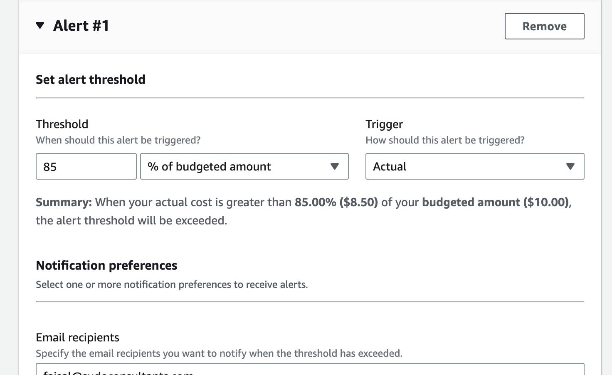
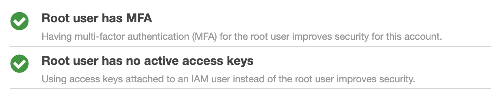
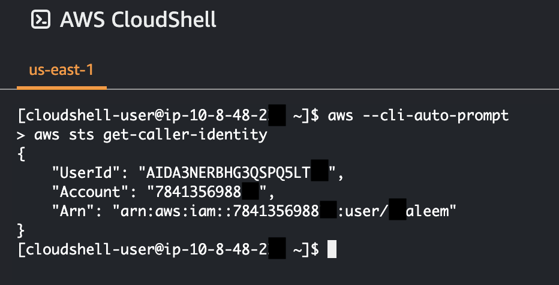

# Week 0 — Billing and Architecture

## Prior to starting Week0
- Read the bootcamp outline document
- Setup a new AWS Account
- Template github repo in personal github
- Validated a free domain
- Signup a Lucid charts account
- Signup a Gitpod account
- Didn't setup Github Codespace account as felt local VScode and gitpod should be sufficient
- Signup a Momento Account
- Signup a Honeycomb account
- Signup a Rollbar account

## Attended Week0 Live broadcast
- Created a napkin design on LucidChart along with the session
    - [LucidChart Public View Link](https://lucid.app/lucidchart/59c3ab65-d80b-4c9a-9265-6b0fcb638e8d/edit?viewport_loc=-310%2C-305%2C2264%2C1272%2C0_0&invitationId=inv_c1430647-594e-472a-b495-85048a89cf3d)

## Homework Part
- Watched Chirag Spend Consideration
    - Setup AWS Budgets
    - 
    - Setup AWS Budget Alerts
    - 
- Watched Ashish Security Consideration
    - Setup MFA on root account
    - 
    - Setup Organization
- Watched Andrew Week 0 - Generate Credentials, AWS CLI, Budget and Billing Alarm via CLI
    - Created a user account
    - Created a group for user account
    - Assigned Admin permission
    - Created alias for AWS account
    - Setup MFA for new user account
    - Create Access Key for CLI access
    - AWS CLI installation on gitpod vscode online terminal
    - Setup environment variable for AWS CLI access such as access id, secret key, region
    - While pushing code got error of email expose as my github email is set to private and wanted to prefer the same way therefore did a setup of VSCode on local machine
    - git clone repo locally
    - Authenticated local VScode with github, will be using this as it's daily driver in my current job role and would prefer to be more comfortable on it.
    - Validated git add, commit, push to main - all working as expected
    - Created an images folder in repo, added all screenshot/images (aws-bootcamp-crudder-2023/images) in the folder to link it in journal md files.
    - AWS CLI is prior installed on local machine via aws instructions for mac, validated it's working
    - 
    - Setup AWS Configure on local machine in vs code and provided required info such as account, accesskey, region
    - Setup auto-prompt partial in ~/.aws/config by adding "cli_auto_prompt = on-partial"
    - Used AWS Cloudshell
    - 

### Watched Week 0 - Lucid Charts Lets Recreate the Cruddur Logical Diagram
- Created a logical diagram on LucidChart
    - [LucidChart Public View Link](https://lucid.app/lucidchart/59c3ab65-d80b-4c9a-9265-6b0fcb638e8d/edit?viewport_loc=-100%2C261%2C2264%2C1196%2CMxKxoGtxBBi0&invitationId=inv_c1430647-594e-472a-b495-85048a89cf3d)

#### Watched Week 0 - Homework Idea (Well Architected Tool)
#### Watched FREE AWS Cloud Project Bootcamp - Homework Grading Considerations
#### Updating Your Journal in Github
#### Scrubing Github History of Sensitive Data
    - Eradicated content in image

## Homework Challenges
- Destroy your root account credentials, Set MFA, IAM role
    - Completed
    - 
- Review all the questions of each pillars in the Well Architected Tool (No specialized lens)
    - Did partially as already aware of many from past experience
    - [AWS WA Questions](https://docs.aws.amazon.com/wellarchitected/latest/framework/sec-02.html)
- Create an architectural diagram (to the best of your ability) the CI/CD logical pipeline in Lucid Charts
    - [LucidChart Public View Link](https://lucid.app/lucidchart/59c3ab65-d80b-4c9a-9265-6b0fcb638e8d/edit?viewport_loc=-11%2C-11%2C2264%2C1272%2CJffzE39adRwv&invitationId=inv_c1430647-594e-472a-b495-85048a89cf3d)
    - 
- Research the technical and service limits of specific services and how they could impact the technical path for technical flexibility. 
    - [S3 Service Quota](https://docs.aws.amazon.com/general/latest/gr/s3.html)
    - 100 bucket per region is limit for S3, for enterprise companies which have large scale s3 bucket requirements such as Cloud Storage providers i.e. Dropbox the limit can affect scalability per region.
- Open a support ticket and request a service limit
    - Requested for AWS support service limit
    - 

