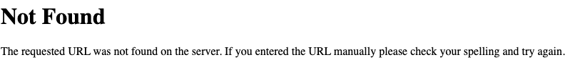
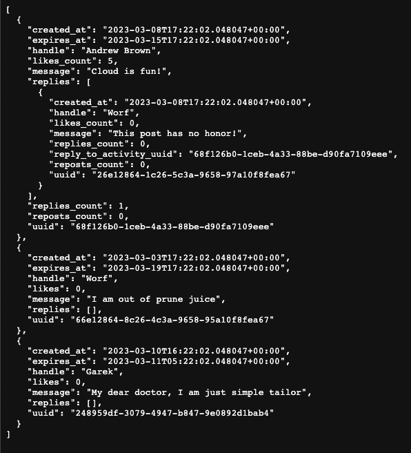
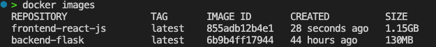
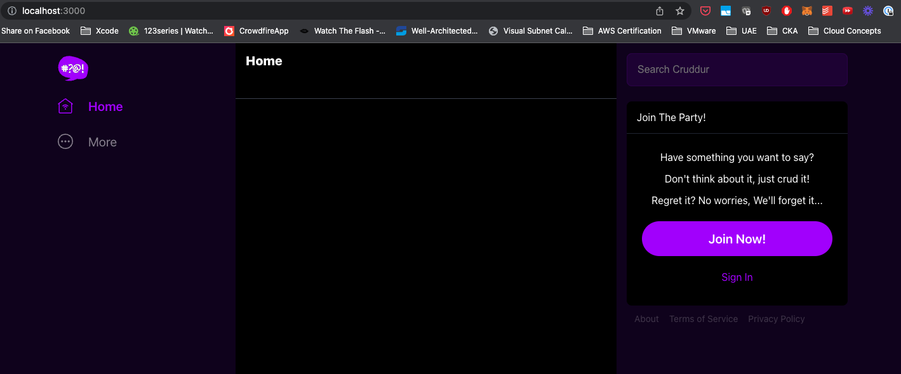

# Week 1 — App Containerization

## Attended Week0 Live broadcast offline
TO ADD URL >>>>

## Activities performed part of Live broadcast
- Create a docker file in backend-flash
- Installed content on requirements.txt via pip3
- Set env vars to * from FRONTEND_URL and BACKEND_URL
- Started the application on local system
- I was able to see json data with appended url /api/activities/home on localhost URL
- Tried to build docker container but faced an error "ERROR: Cannot connect to the Docker daemon at unix:///var/run/docker.sock. Is the docker daemon running?"
- Resolved it by running docker for mac which started docker daemon as it was unused for a very long time and updated it
- Tried to build docker container but faced with another error "failed to solve with frontend dockerfile.v0: failed to read dockerfile: open /var/lib/docker/tmp/buildkit-mount1677032260/Dockerfile: no such file or directory"
- I realized it was unable to find the Dockerfile whereas I had it created, then based on review it is case sensitive file and I had a capital "F" in file word of it.
- Resolved and tried to build docker again and this time it was a SUCCESS
- Figured out the Dockerfile case sensitive issue was not detected as change by git therefore renamed it and updated and renamed it back then uploaded it again.
- Build docker run without variables set, and got ERROR as expected

- I was able to run the newly build container running
```docker run --rm -p 4567:4567 -it -e FRONTEND_URL='*' -e BACKEND_URL='*' backend-flask```

- Created a Dockerfile in frontend director and copied the required content in it.
- Created another container image by running docker build -t frontend-reach-js ./frontend-reach-js from project home director

- Ran frontend container and was a success
